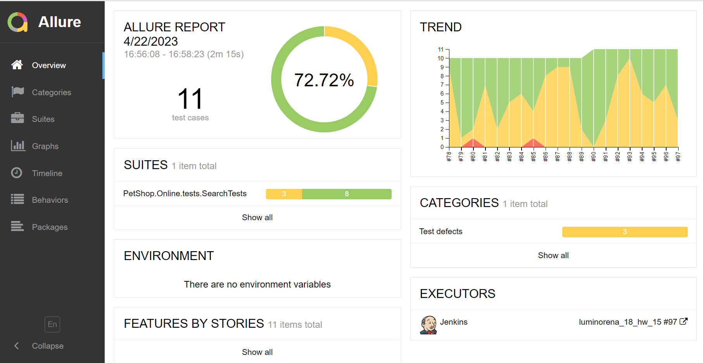
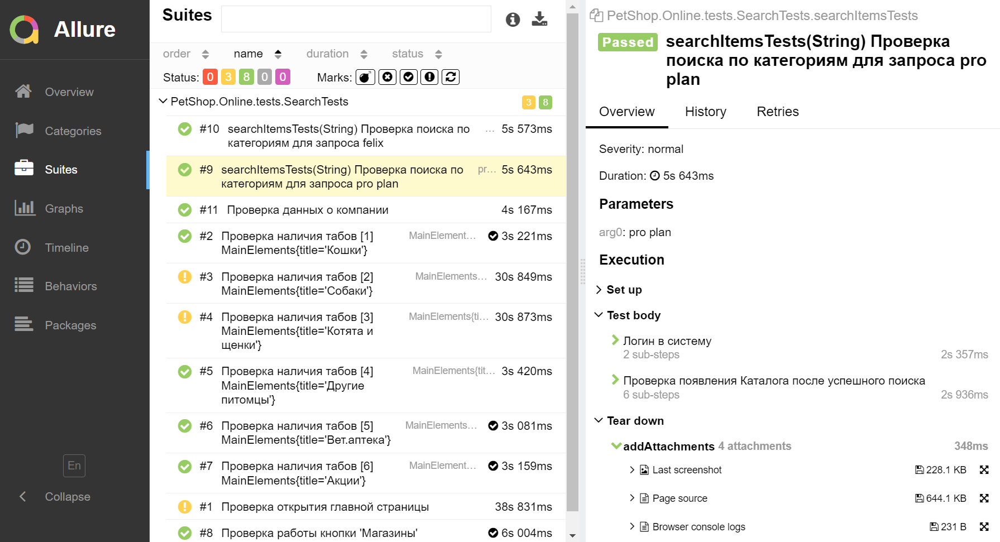
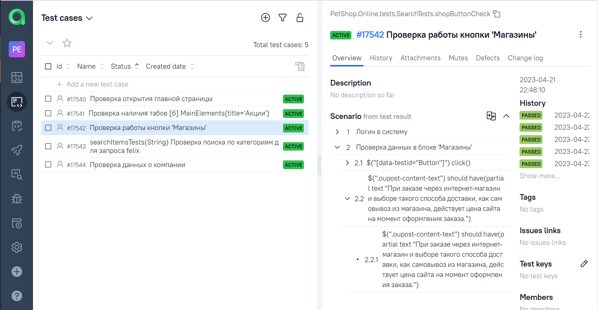
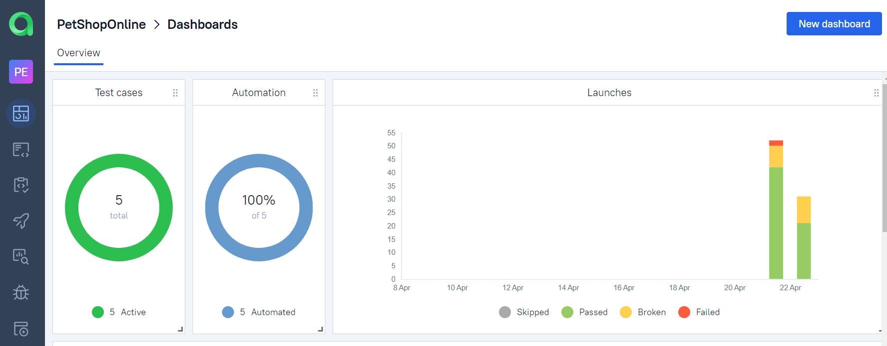
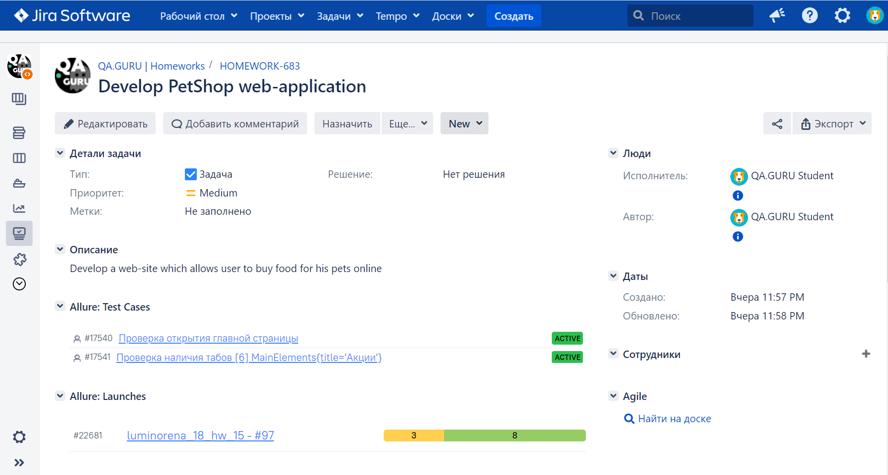
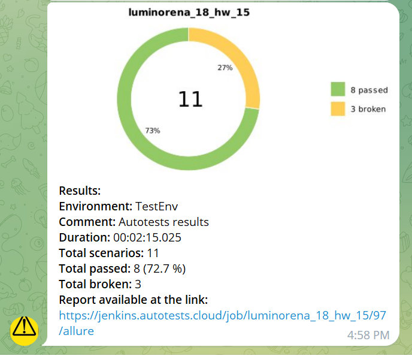

# Проект по автоматизации UI тестирования Интернет-магазина petshop.ru

## Содержание

> ➠ [Стек технологий](#technologies)
>
> ➠ [Тест кейсы](#test-cases)
>
> ➠ [Локальный запуск тестов](#run-tests-locally)
>
> ➠ [Удалённый запуск тестов на Jenkins](#run-tests-via-Jenkins)
>
> ➠ [Allure отчётность](#allure-reports)
>
> ➠ [Интеграция с Allure TestOps](#allure-testOps)
>
> ➠ [Интеграция с Atlassian Jira](#atlassian-jira)
>
> ➠ [Уведомления в Telegram](#telegram)

## Стек технологий
### В проекте использованы следующие технологии
Java Gradle IntelliJ IDEA Selenide Selenoid JUnit5 Jenkins Allure Report Allure TestOps Telegram Jira

<p align="center">
<a href="https://www.jetbrains.com/idea/"></a>
<a href="https://www.java.com/"></a>
<a href="https://github.com/"></a>
<a href="https://junit.org/junit5/"></a>
<a href="https://gradle.org/"></a>
<a href="https://selenide.org/"></a>
<a href="https://aerokube.com/selenoid/"></a>
<a href="https://github.com/allure-framework/allure2"></a>
<a href="https://https://qameta.io/"></a>
<a href="https://www.jenkins.io/"></a>
<a href="https://https://telegram.org/"></a>
</p>

## Тест кейсы

 ✓ Проверка открытия главной страницы <br>
 ✓ Проверка поиска по категориям для разных запросов (параметризованные тесты) <br>
 ✓ Проверка наличия меню на сайте <br>
 ✓ Проверка блока данных о компании <br>
 ✓ Проверка работы кнопки 'Магазины' <br>

##  Локальный запуск тестов

Тесты запускаются в терминале командой:
```bash
-Denv=local
```
Запуск Allure отчёта через терминал:
```bash
allure serve build/allure-results
```

##  Удалённый запуск тестов на Jenkins
1. Перейти по ссылке <a target="_blank" href="https://jenkins.autotests.cloud/job/luminorena_18_hw_15/">the project</a>
2. Выбрать пункт в меню **Собрать с параметрами**
3. Изменить параметры запуска или собрать с параметрами по умолчанию
4. Чтобы посмотреть логи сборки, нажать на новую сборку -> вывод консоли
5. Результаты тестирования выводятся в Allure отчётах, чтобы перейти к результатам, нажать на иконки рядом

## Allure отчётность

###  Основная страница

<p align="center">

</p>

###  Страница с тестами и статистикой

<p align="center">

</p>


## Интеграция с Allure TestOps

### Ручные и автоматизированные тесты
<p align="center">

</p>

### Dashboard
<p align="center">

</p>

## Интеграция с Atlassian Jira
<p align="center">

</p>

## Уведомления в Telegram

<p align="center">

</p>
